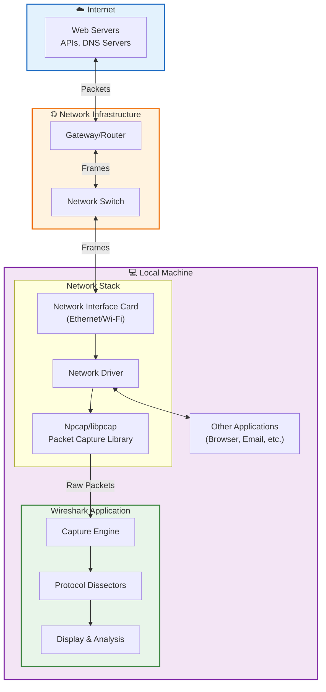
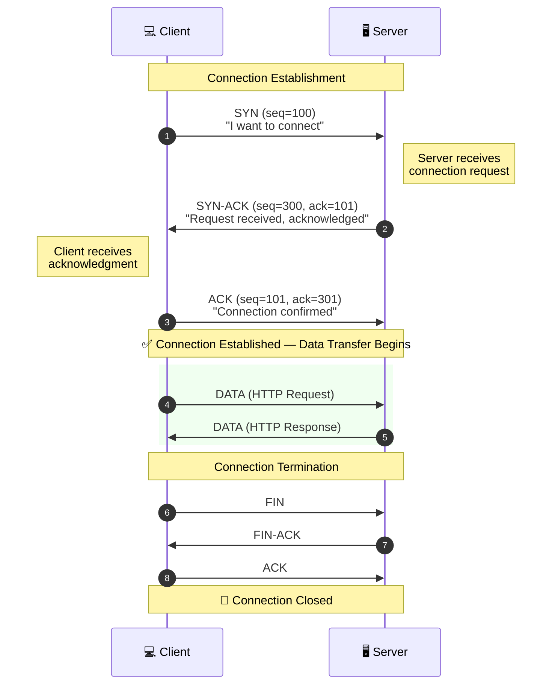
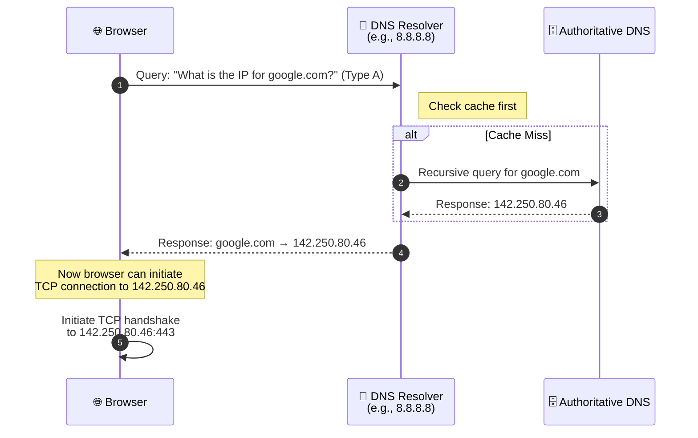
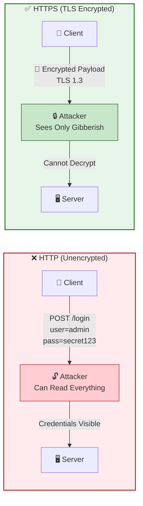

# 🦈 Network Traffic Analysis with Wireshark

> **Hands-on lab demonstrating packet capture, protocol analysis, and network forensics fundamentals.**

[](https://www.wireshark.org/)
[](https://www.comptia.org/certifications/network)
[](https://www.comptia.org/certifications/security)
[](https://www.comptia.org/certifications/cybersecurity-analyst)

---

## 📋 Table of Contents

- [Overview](#overview)
- [Architecture](#architecture)
- [Skills Demonstrated](#skills-demonstrated)
- [Prerequisites](#prerequisites)
- [Lab Exercises](#lab-exercises)
  - [Exercise A: DNS Query Analysis](#exercise-a-dns-query-analysis)
  - [Exercise B: TCP Three-Way Handshake](#exercise-b-tcp-three-way-handshake)
  - [Exercise C: Cleartext Credential Detection](#exercise-c-cleartext-credential-detection)
  - [Exercise D: TCP Stream Reconstruction](#exercise-d-tcp-stream-reconstruction)
- [Key Findings & Evidence](#key-findings--evidence)
- [Display Filter Reference](#display-filter-reference)
- [Career Relevance](#career-relevance)
- [Repository Structure](#repository-structure)

---

## Overview

This lab provides hands-on experience with **Wireshark**, the industry-standard network protocol analyzer. The exercises demonstrate real-world network analysis techniques used by SOC analysts, network engineers, and incident responders to diagnose connectivity issues, identify malicious traffic, and investigate security incidents.

| Field | Value |
|-------|-------|
| **Tool** | Wireshark (free, open-source) |
| **Environment** | Local machine or Azure VM |
| **Time to Complete** | 2–4 hours |
| **Cost** | $0 |

---

## Architecture

### How Wireshark Captures Network Traffic

The diagram below illustrates the packet capture flow — from internet traffic traversing the network stack down to Wireshark's capture engine.



**Key Insight:** Wireshark operates at the network interface level, intercepting packets *before* they reach applications and *after* they leave. In **promiscuous mode**, it captures all traffic on the network segment — not just packets addressed to your machine.

---

### TCP Three-Way Handshake Flow

Every TCP connection begins with this handshake. Understanding it is fundamental to diagnosing connectivity issues.



**Diagnostic Value:**
- **SYN without SYN-ACK** → Server unreachable or connection refused
- **RST packet** → Connection forcibly reset (firewall, service down)
- **Excessive retransmissions** → Network congestion or packet loss

---

### DNS Resolution Flow

DNS queries occur before virtually every network connection. Malicious DNS queries are often the first indicator of compromise.



---

### HTTP vs HTTPS Security Comparison

This lab demonstrates why HTTPS is mandatory for any sensitive data transmission.



---

## Skills Demonstrated

| Skill | Real-World Application |
|-------|------------------------|
| **Live Traffic Capture** | Foundation of all network analysis — capture what's actually happening on the wire |
| **Display Filter Mastery** | Isolate relevant packets from millions in seconds |
| **TCP Handshake Analysis** | Instantly determine if connections succeed or fail, and why |
| **DNS Query Inspection** | Detect unusual domain lookups, diagnose name resolution failures |
| **Cleartext Credential Detection** | Demonstrate HTTP vulnerabilities, validate HTTPS implementation |
| **TCP Stream Reconstruction** | Reassemble full conversations for incident investigation |

---

## Prerequisites

- **Wireshark** installed ([download here](https://www.wireshark.org/download.html))
- **Npcap** (Windows) or **libpcap** (Linux/macOS) for packet capture
- Terminal/Command Prompt access for `nslookup` commands
- Basic understanding of TCP/IP networking

### Installation Quick Reference

| OS | Installation |
|----|--------------|
| **Windows** | Download `.exe` installer, accept defaults, install Npcap when prompted |
| **macOS** | Download `.dmg`, allow ChmodBPF when prompted |
| **Linux** | `sudo apt install wireshark && sudo usermod -aG wireshark $USER` |

---

## Lab Exercises

### Exercise A: DNS Query Analysis

**Objective:** Capture and analyze DNS resolution traffic.

**Steps Performed:**
1. Started packet capture on active network interface
2. Executed `nslookup google.com` from terminal
3. Applied `dns` display filter
4. Identified query packet (Standard query A google.com)
5. Located response packet with resolved IP address
6. Verified IP in packet matched terminal output

**What This Demonstrates:**
- DNS queries happen before every network connection
- Unusual DNS queries (random-looking domains, high frequency) indicate potential malware C2 communication
- DNS failures cascade — if DNS breaks, nothing works

---

### Exercise B: TCP Three-Way Handshake

**Objective:** Observe and understand TCP connection establishment.

**Steps Performed:**
1. Captured traffic while navigating to `http://example.com`
2. Applied filter: `tcp and ip.addr == [target IP]`
3. Identified the three-packet sequence:
   - **Packet 1:** SYN (client initiates)
   - **Packet 2:** SYN-ACK (server acknowledges)
   - **Packet 3:** ACK (connection established)

**Diagnostic Patterns Learned:**
| Pattern | Meaning |
|---------|---------|
| SYN → SYN-ACK → ACK | ✅ Normal connection |
| SYN → (nothing) | ❌ Server unreachable / filtered |
| SYN → RST | ❌ Connection refused (port closed) |

---

### Exercise C: Cleartext Credential Detection

**Objective:** Demonstrate the security risk of unencrypted HTTP.

> ⚠️ **Note:** This exercise was performed only on owned/authorized test systems.

**Steps Performed:**
1. Submitted test credentials via HTTP login form
2. Applied filter: `http.request.method == POST`
3. Located the POST request packet
4. Expanded "HTML Form URL Encoded" section
5. **Observed username and password in plaintext**

**Security Implication:** Anyone on the network path (ISP, compromised router, MITM attacker) can read HTTP credentials. This is why HTTPS is mandatory for all authentication.

---

### Exercise D: TCP Stream Reconstruction

**Objective:** Reassemble fragmented packets into a complete conversation.

**Steps Performed:**
1. Captured HTTP traffic
2. Right-clicked HTTP packet → Follow → TCP Stream
3. Viewed complete request/response conversation:
   - **Red text:** Client request
   - **Blue text:** Server response

**Incident Response Application:** Stream reconstruction reveals the full context of network events — what data was transferred, what commands were executed, and how the server responded.

---

## Key Findings & Evidence

### Sample Captures Included

| File | Description |
|------|-------------|
| `captures/dns-lookup.pcapng` | DNS query and response for google.com |
| `captures/tcp-handshake.pcapng` | Complete three-way handshake to example.com |
| `captures/http-stream.pcapng` | Full HTTP conversation with stream reconstruction |

### Screenshots

*Add screenshots of your Wireshark captures here:*
- DNS query/response packets
- TCP handshake sequence
- TCP stream follow output

---

## Display Filter Reference

Quick reference for the most useful Wireshark display filters:

```
# Protocol Filters
dns                          # All DNS traffic
http                         # HTTP only (unencrypted)
tcp                          # All TCP traffic
icmp                         # Ping and network diagnostics

# TCP Flag Filters
tcp.flags.syn == 1           # Connection attempts
tcp.flags.reset == 1         # Connection resets
tcp.flags.fin == 1           # Connection terminations

# Address Filters
ip.addr == 192.168.1.1       # Traffic to/from specific IP
ip.src == 10.0.0.5           # Traffic FROM specific source
ip.dst == 10.0.0.5           # Traffic TO specific destination

# Port Filters
tcp.port == 443              # HTTPS traffic
tcp.port == 80               # HTTP traffic
udp.port == 53               # DNS traffic

# HTTP Specific
http.request                 # HTTP requests only
http.request.method == POST  # POST requests (form submissions)
http.request.method == GET   # GET requests
```

---

## Career Relevance

This lab builds foundational skills applicable across multiple security and networking roles:

| Role | How These Skills Apply |
|------|------------------------|
| **SOC Analyst** | Identify malicious traffic patterns, extract IOCs from packet captures |
| **Network Engineer** | Diagnose connectivity issues, verify traffic flow |
| **Cloud Security Engineer** | Mental model transfers to Azure Network Watcher and VPC Flow Logs |
| **Incident Responder** | Reconstruct attack timelines from network evidence |
| **Help Desk** | Prove network issues exist and identify client vs. server-side problems |

---

## Repository Structure

```
wireshark-network-analysis/
├── README.md                    # This file
├── captures/
│   ├── dns-lookup.pcapng       # Exercise A capture
│   ├── tcp-handshake.pcapng    # Exercise B capture
│   └── http-stream.pcapng      # Exercise D capture
├── screenshots/
│   ├── dns-query-response.png
│   ├── tcp-syn-synack-ack.png
│   └── tcp-stream-follow.png
└── docs/
    └── filter-cheatsheet.md    # Extended filter reference
```

---

## Resources

- [Wireshark Official Documentation](https://www.wireshark.org/docs/)
- [Wireshark Display Filter Reference](https://www.wireshark.org/docs/dfref/)
- [CompTIA Network+ Study Guide](https://www.comptia.org/certifications/network)
- [SANS Reading Room - Packet Analysis](https://www.sans.org/reading-room/)

---

## Author

**[Your Name]**  
Cloud Security Professional | Network Analysis | Incident Response

[](https://linkedin.com/in/yourprofile)
[](https://github.com/yourusername)

---

*This lab was completed as part of a hands-on cybersecurity portfolio. All exercises were performed on owned/authorized systems.*
